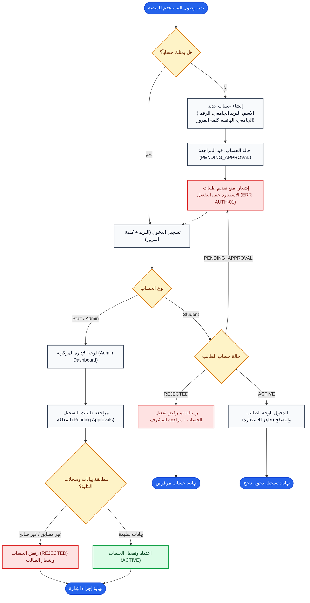

# مسار مصادقة وإدارة الحسابات (Auth & Account Management Flow)

## 1. الهدف من المهمة (Task Objective)
إدارة تسجيل حسابات الطلاب ومراجعة وتفعيل الحسابات من قبل المشرفين، والتحكم في صلاحيات الوصول للمنصة.

---

## 2. مخطط سير المهمة (Flowchart)

---

## 3. حالات الخطأ والقيود (Business Rules & Errors)
- `ERR-AUTH-01`: منع أي طالب من تقديم طلب استعارة ما لم تكن حالة الحساب `ACTIVE`.
- التدقيق الأكاديمي: يتطلب موافقة يدوية من موظف المعمل للتأكد من هوية الطالب.
