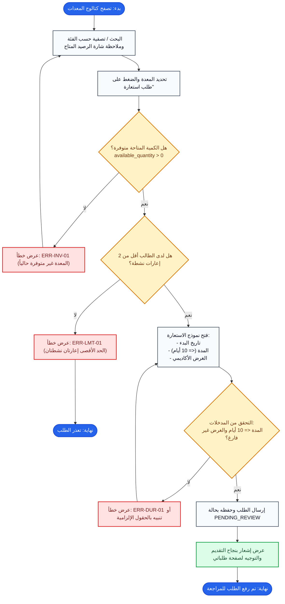

# مسار تصفح وإنشاء طلب استعارة (Borrow Request Creation Flow)

## 1. الهدف من المهمة (Task Objective)
تمكين الطالب المفعل من استعراض الكتالوج، فحص التوفر، والتحقق من قيود الحد الأقصى والمدة وتقديم طلب الاستعارة.

---

## 2. مخطط سير المهمة (Flowchart)

---

## 3. حالات الخطأ والقيود (Business Rules & Errors)
- `ERR-INV-01`: حظر الطلب إذا كان `available_quantity <= 0`.
- `ERR-LMT-01`: الحد الأقصى لكل طالب هو إعارتان نشطتان (`PENDING_REVIEW` أو `APPROVED` أو `CHECKED_OUT`).
- `ERR-DUR-01`: أقصى مدة للاستعارة 10 أيام ميلادية مع كتابة غرض أكاديمي إلزامي.
