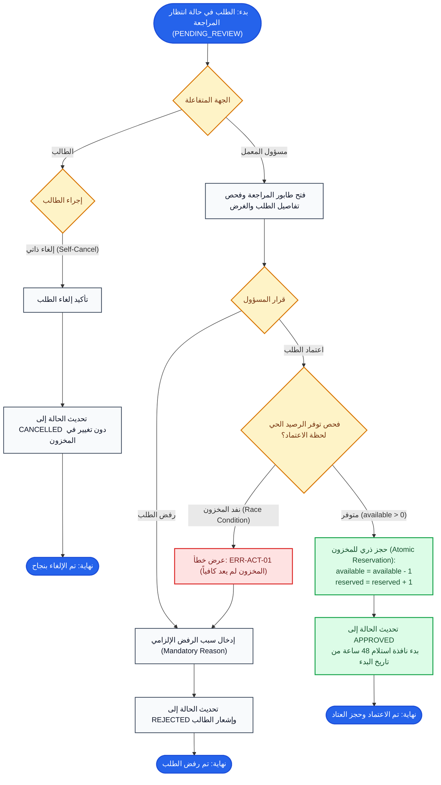

# مسار مراجعة واعتماد الطلبات وإلغائها (Approval & Cancellation Flow)

## 1. الهدف من المهمة (Task Objective)
معالجة الطلب المعلق (`PENDING_REVIEW`) سواء بالإلغاء الذاتي من قبل الطالب، أو بالمراجعة والاعتماد/الرفض من قبل مسؤول المعمل مع التعامل مع حجز المخزون الذري.

---

## 2. مخطط سير المهمة (Flowchart)

---

## 3. حالات الخطأ والقيود (Business Rules & Errors)
- `ERR-ACT-01`: حماية ضد السباق المتزامن (Race Conditions) أثناء الاعتماد عند نفاد الرصيد المتاح.
- إلغاء الطالب: متاح فقط والطلب بحالة `PENDING_REVIEW` ولا يتطلب أي تعديل على المخزون (لأنه لم يُحجز بعد).
- سبب الرفض: إلزامي عند اتخاذ قرار الرفض ليظهر في سجل الطالب.
