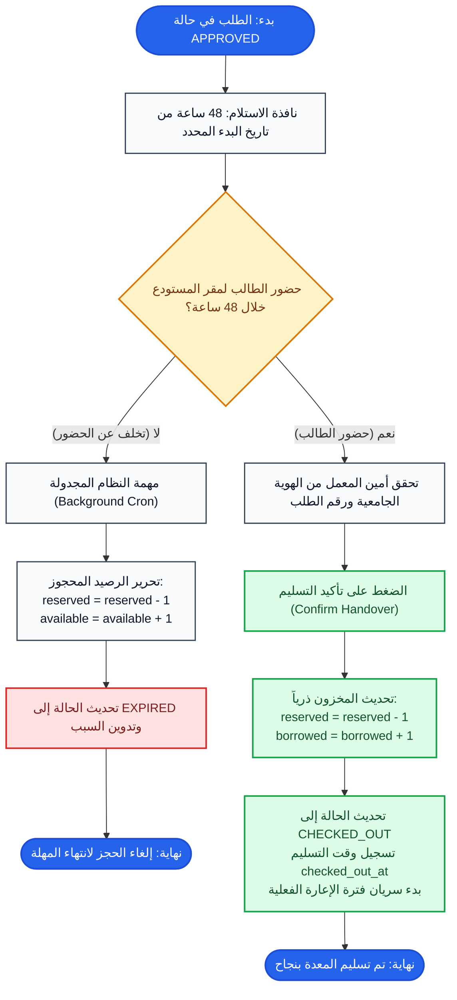

# مسار الاستلام والتسليم المكتبي (Pickup & Checkout Flow)

## 1. الهدف من المهمة (Task Objective)
معالجة نافذة استلام العتاد (48 ساعة)، تسليم المعدة في مكتب المعمل وتحويل حالتها إلى `CHECKED_OUT`، أو معالجة انتهاء المهلة (`EXPIRED`) واستعادة المخزون.

---

## 2. مخطط سير المهمة (Flowchart)

---

## 3. حالات الخطأ والقيود (Business Rules & Errors)
- نافذة الـ 48 ساعة: إذا لم يحضر الطالب يتم وسم الطلب بـ `EXPIRED` وإرجاع القطعة من `reserved` إلى `available`.
- التسليم اليدوي: يتم حصرياً بواسطة مسؤول المعمل بعد مطابقة بطاقة الهوية الجامعية.
