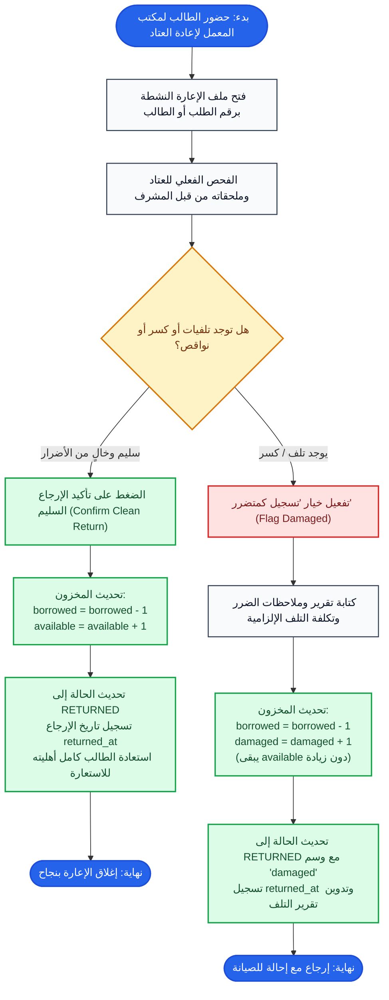

# مسار الإرجاع، الفحص، وتسجيل التلفيات (Return & Inspection Flow)

## 1. الهدف من المهمة (Task Objective)
معاينة واستلام الأجهزة المرجعة وفحص حالتها الفنية وتحديد مسار الإرجاع (سليم مع زيادة المتاح، أو متضرر مع توجيهه لحالة التلف/الصيانة).

---

## 2. مخطط سير المهمة (Flowchart)

---

## 3. حالات الخطأ والقيود (Business Rules & Errors)
- تقرير التلف: إلزامي عند الإرجاع المتضرر.
- المخزون: في الإرجاع السليم يعود الرصيد إلى `available`. في المتضرر ينتقل إلى `damaged` ولا يتاح للطلاب حتى الإصلاح.
