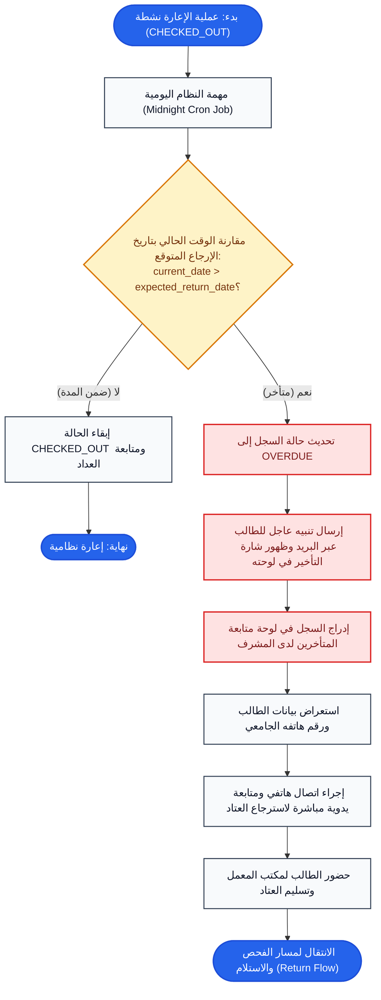

# مسار رصد التأخير والمتابعة (Overdue Tracking Flow)

## 1. الهدف من المهمة (Task Objective)
مراقبة تواريخ الإرجاع المتوقعة، وسم الإعارات المتجاوزة لمهلة الـ 10 أيام كـ `OVERDUE`، وإجراء المتابعة الإدارية والتواصل لاسترداد المعدات.

---

## 2. مخطط سير المهمة (Flowchart)

---

## 3. حالات الخطأ والقيود (Business Rules & Errors)
- حد الإعارة: الحد الأقصى للإعارة 10 أيام ميلادية.
- المتابعة: التواصل المباشر هاتفياً عند التأخر لحماية الأصول الأكاديمية وضمان تدويرها.
