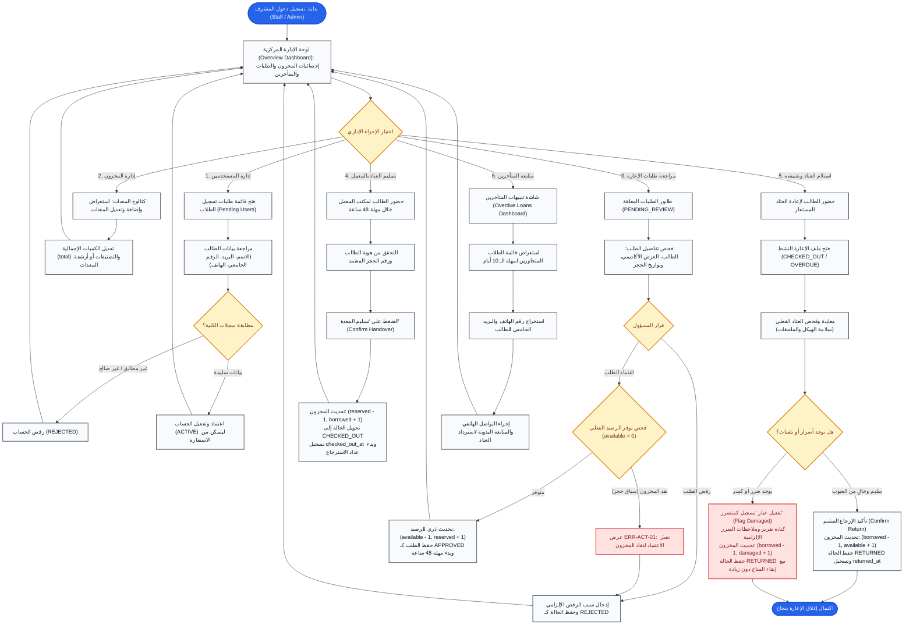

# User Flow: مسار استعارة وإرجاع المعدات (BorrowHub MVP Core User Flow)

- **اسم المسار (Flow Title):** دورة حياة استعارة المعدات (Equipment Borrowing & Return Lifecycle)
- **الأدوار المعنية (User Roles):** 
  - **الطالب (Student):** طالب جامعي معتمد يطلب المعدات ويستلمها ويعيدها.
  - **مسؤول المعمل / المستودع (Admin / Staff):** مراجعة الطلبات، تسليم المعدات فعلياً، استلامها وفحصها، ورصد التأخير والأضرار.
  - **النظام (System):** عمليات التحقق البرمجية، تحديث المخزون الذري (Atomic Transactions)، وإلغاء الحجوزات المنتهية تلقائياً.
- **الهدف من المسار (Flow Objective):** تمكين الطالب من حجز عتاد دراسي بحد أقصى 10 أيام، وإدارة دورة حياة الحجز كاملة من الطلب والموافقة والتسليم وحتى الإرجاع (سليماً أو متضرراً) أو التأخر، مع صيانة دقيقة للمخزون ومنع التضارب.

---

## 1. مخطط التدفق (Mermaid Flowchart)

```mermaid
flowchart TD
    %% Entry Point
    StartNode(["البداية: تسجيل الدخول للوحة الطالب"])
    CheckAuth{"هل حساب الطالب معتمد ومفعل؟ (ACTIVE)"}
    ErrAuth["عرض رسالة خطأ ERR-AUTH-01: الحساب قيد المراجعة أو مرفوض"]
    StopAuth(["نهاية: منع تقديم الطلب"])

    StartNode --> CheckAuth
    CheckAuth -- "لا (PENDING_APPROVAL / REJECTED)" --> ErrAuth
    ErrAuth --> StopAuth

    BrowseCatalog["تصفح كتالوج المعدات المتاحة"]
    SelectItem["اختيار المعدة والضغط على طلب استعارة"]
    CheckStock{"هل المخزون متوفر؟ (available_quantity > 0)"}
    ErrStock["عرض خطأ ERR-INV-01: المعدة غير متوفرة حالياً"]

    CheckAuth -- "نعم" --> BrowseCatalog
    BrowseCatalog --> SelectItem
    SelectItem --> CheckStock
    CheckStock -- "لا" --> ErrStock
    ErrStock --> BrowseCatalog

    CheckLimit{"هل يمتلك الطالب أقل من 2 طلبات نشطة؟ (< 2 active loans)"}
    ErrLimit["عرض خطأ ERR-LMT-01: تجاوز الحد الأقصى (طلبان نشطان)"]
    FillRequestForm["تعبئة نموذج الطلب: تحديد المدة والغرض الأكاديمي"]

    CheckStock -- "نعم" --> CheckLimit
    CheckLimit -- "لا" --> ErrLimit
    ErrLimit --> BrowseCatalog
    CheckLimit -- "نعم" --> FillRequestForm

    ValidateForm{"هل المدة <= 10 أيام والغرض غير فارغ؟"}
    ErrDuration["عرض خطأ ERR-DUR-01 أو مطالبة بتعبئة الغرض"]
    SubmitRequest["إرسال الطلب وحفظه بحالة (PENDING_REVIEW)"]
    StudentPending{"هل قرر الطالب إلغاء الطلب قبل المراجعة؟"}

    FillRequestForm --> ValidateForm
    ValidateForm -- "لا" --> ErrDuration
    ErrDuration --> FillRequestForm
    ValidateForm -- "نعم" --> SubmitRequest
    SubmitRequest --> StudentPending

    CancelByStudent["إلغاء الطلب ذاتياً وتغيير الحالة إلى CANCELLED"]
    TerminateCancelled(["نهاية: تم إلغاء الطلب دون التأثير على المخزون"])
    AdminReviewQueue["ظهور الطلب في لوحة مراجعة المسؤول (Admin)"]
    AdminApprovalDecision{"قرار المسؤول: اعتماد أم رفض الطلب؟"}

    StudentPending -- "نعم" --> CancelByStudent
    CancelByStudent --> TerminateCancelled
    StudentPending -- "لا" --> AdminReviewQueue
    AdminReviewQueue --> AdminApprovalDecision

    AdminRejectReason["إدخال سبب الرفض الإلزامي وحفظ الحالة REJECTED"]
    TerminateRejected(["نهاية: تم رفض الطلب مع إشعار الطالب بالسبب"])
    CheckStockAtApproval{"هل المخزون لا يزال متوفراً؟ (available_quantity > 0)"}
    ErrApprovalStock["عرض خطأ ERR-ACT-01: تعذر الاعتماد لنفاد المخزون"]
    AtomicReservation["تحديث ذري للمخزون: تخصيص المعدة<br/>(available - 1, reserved + 1)<br/>تغيير الحالة إلى APPROVED"]

    AdminApprovalDecision -- "رفض" --> AdminRejectReason
    AdminRejectReason --> TerminateRejected
    AdminApprovalDecision -- "اعتماد" --> CheckStockAtApproval
    CheckStockAtApproval -- "لا" --> ErrApprovalStock
    ErrApprovalStock --> AdminRejectReason
    CheckStockAtApproval -- "نعم" --> AtomicReservation

    PickupWindow{"هل حضر الطالب للاستلام خلال 48 ساعة؟"}
    SystemExpire["انتهاء صلاحية الحجز تلقائياً (EXPIRED)<br/>إعادة المخزون: (reserved - 1, available + 1)"]
    TerminateExpired(["نهاية: إلغاء الحجز لعدم الحضور"])
    AdminHandover["التحقق من هوية الطالب وتأكيد التسليم الفعلي من المسؤول"]
    SystemCheckout["تغيير الحالة إلى (CHECKED_OUT)<br/>نقل الحساب: (reserved - 1, borrowed + 1)<br/>بدء عداد الإرجاع التنازلي"]

    AtomicReservation --> PickupWindow
    PickupWindow -- "لا (انقضاء المهلة)" --> SystemExpire
    SystemExpire --> TerminateExpired
    PickupWindow -- "نعم" --> AdminHandover
    AdminHandover --> SystemCheckout

    MonitoringLoan{"هل تجاوز موعد الإرجاع المتوقع قبل إعادة العتاد؟"}
    FlagOverdue["تحديد الحالة كـ OVERDUE وإدراج الطالب في لوحة الإنذارات للمتابعة اليدوية"]
    ReturnDesk["حضور الطالب لمكتب الإرجاع"]
    AdminInspection["معاينة وفحص العتاد الفعلي من قبل المسؤول"]
    CheckDamage{"هل المعدة متضررة أو بها تلف؟"}

    SystemCheckout --> MonitoringLoan
    MonitoringLoan -- "نعم" --> FlagOverdue
    FlagOverdue --> ReturnDesk
    MonitoringLoan -- "لا" --> ReturnDesk
    ReturnDesk --> AdminInspection
    AdminInspection --> CheckDamage

    ReturnDamaged["تسجيل ملاحظات الضرر، تأكيد الإرجاع DAMAGED<br/>خصم من المستعار وزيادة التالف:<br/>(borrowed - 1, damaged + 1) دون استعادة المتاح"]
    SuccessDamagedReturn(["نهاية: إغلاق الإعارة بنجاح كـ RETURNED مع تسجيل التلف"])
    ReturnHealthy["تأكيد الإرجاع بنقرة واحدة (RETURNED)<br/>استعادة المخزون:<br/>(borrowed - 1, available + 1)"]
    SuccessIntactReturn(["نهاية: إغلاق الإعارة بنجاح واستعادة العتاد للمخزون"])

    CheckDamage -- "نعم" --> ReturnDamaged
    ReturnDamaged --> SuccessDamagedReturn
    CheckDamage -- "لا (سليمة)" --> ReturnHealthy
    ReturnHealthy --> SuccessIntactReturn

    %% Styling & Classes
    classDef startEnd fill:#2563eb,stroke:#1d4ed8,stroke-width:2px,color:#fff;
    classDef action fill:#f8fafc,stroke:#334155,stroke-width:1.5px,color:#0f172a;
    classDef decision fill:#fef3c7,stroke:#d97706,stroke-width:2px,color:#78350f;
    classDef success fill:#dcfce7,stroke:#16a34a,stroke-width:2px,color:#14532d;
    classDef failure fill:#fee2e2,stroke:#dc2626,stroke-width:2px,color:#7f1d1d;

    class StartNode,StopAuth,TerminateCancelled,SuccessDamagedReturn startEnd;
    class BrowseCatalog,SelectItem,FillRequestForm,SubmitRequest,CancelByStudent,AdminReviewQueue,AdminRejectReason,AtomicReservation,SystemExpire,AdminHandover,SystemCheckout,ReturnDesk,AdminInspection,ReturnHealthy action;
    class CheckAuth,CheckStock,CheckLimit,ValidateForm,StudentPending,AdminApprovalDecision,CheckStockAtApproval,PickupWindow,MonitoringLoan,CheckDamage decision;
    class SuccessIntactReturn success;
    class ErrAuth,ErrStock,ErrLimit,ErrDuration,TerminateRejected,ErrApprovalStock,TerminateExpired,FlagOverdue,ReturnDamaged failure;
```



---

## 2. كود المخطط بصيغة مستقلة (Raw Mermaid Code for Mermaid Live)

يمكن نسخ الكود البرمجي أدناه ولصقه مباشرة في [Mermaid Live Editor](https://mermaid.live):

```text
flowchart TD
    StartNode(["البداية: تسجيل الدخول للوحة الطالب"])
    CheckAuth{"هل حساب الطالب معتمد ومفعل؟ (ACTIVE)"}
    ErrAuth["عرض رسالة خطأ ERR-AUTH-01: الحساب قيد المراجعة أو مرفوض"]
    StopAuth(["نهاية: منع تقديم الطلب"])

    StartNode --> CheckAuth
    CheckAuth -- "لا (PENDING_APPROVAL / REJECTED)" --> ErrAuth
    ErrAuth --> StopAuth

    BrowseCatalog["تصفح كتالوج المعدات المتاحة"]
    SelectItem["اختيار المعدة والضغط على طلب استعارة"]
    CheckStock{"هل المخزون متوفر؟ (available_quantity > 0)"}
    ErrStock["عرض خطأ ERR-INV-01: المعدة غير متوفرة حالياً"]

    CheckAuth -- "نعم" --> BrowseCatalog
    BrowseCatalog --> SelectItem
    SelectItem --> CheckStock
    CheckStock -- "لا" --> ErrStock
    ErrStock --> BrowseCatalog

    CheckLimit{"هل يمتلك الطالب أقل من 2 طلبات نشطة؟ (< 2 active loans)"}
    ErrLimit["عرض خطأ ERR-LMT-01: تجاوز الحد الأقصى (طلبان نشطان)"]
    FillRequestForm["تعبئة نموذج الطلب: تحديد المدة والغرض الأكاديمي"]

    CheckStock -- "نعم" --> CheckLimit
    CheckLimit -- "لا" --> ErrLimit
    ErrLimit --> BrowseCatalog
    CheckLimit -- "نعم" --> FillRequestForm

    ValidateForm{"هل المدة <= 10 أيام والغرض غير فارغ؟"}
    ErrDuration["عرض خطأ ERR-DUR-01 أو مطالبة بتعبئة الغرض"]
    SubmitRequest["إرسال الطلب وحفظه بحالة (PENDING_REVIEW)"]
    StudentPending{"هل قرر الطالب إلغاء الطلب قبل المراجعة؟"}

    FillRequestForm --> ValidateForm
    ValidateForm -- "لا" --> ErrDuration
    ErrDuration --> FillRequestForm
    ValidateForm -- "نعم" --> SubmitRequest
    SubmitRequest --> StudentPending

    CancelByStudent["إلغاء الطلب ذاتياً وتغيير الحالة إلى CANCELLED"]
    TerminateCancelled(["نهاية: تم إلغاء الطلب دون التأثير على المخزون"])
    AdminReviewQueue["ظهور الطلب في لوحة مراجعة المسؤول (Admin)"]
    AdminApprovalDecision{"قرار المسؤول: اعتماد أم رفض الطلب؟"}

    StudentPending -- "نعم" --> CancelByStudent
    CancelByStudent --> TerminateCancelled
    StudentPending -- "لا" --> AdminReviewQueue
    AdminReviewQueue --> AdminApprovalDecision

    AdminRejectReason["إدخال سبب الرفض الإلزامي وحفظ الحالة REJECTED"]
    TerminateRejected(["نهاية: تم رفض الطلب مع إشعار الطالب بالسبب"])
    CheckStockAtApproval{"هل المخزون لا يزال متوفراً؟ (available_quantity > 0)"}
    ErrApprovalStock["عرض خطأ ERR-ACT-01: تعذر الاعتماد لنفاد المخزون"]
    AtomicReservation["تحديث ذري للمخزون: تخصيص المعدة (available - 1, reserved + 1) وتغيير الحالة إلى APPROVED"]

    AdminApprovalDecision -- "رفض" --> AdminRejectReason
    AdminRejectReason --> TerminateRejected
    AdminApprovalDecision -- "اعتماد" --> CheckStockAtApproval
    CheckStockAtApproval -- "لا" --> ErrApprovalStock
    ErrApprovalStock --> AdminRejectReason
    CheckStockAtApproval -- "نعم" --> AtomicReservation

    PickupWindow{"هل حضر الطالب للاستلام خلال 48 ساعة؟"}
    SystemExpire["انتهاء صلاحية الحجز تلقائياً (EXPIRED) وإعادة المخزون: (reserved - 1, available + 1)"]
    TerminateExpired(["نهاية: إلغاء الحجز لعدم الحضور"])
    AdminHandover["التحقق من هوية الطالب وتأكيد التسليم الفعلي من المسؤول"]
    SystemCheckout["تغيير الحالة إلى (CHECKED_OUT) ونقل الحساب: (reserved - 1, borrowed + 1) وبدء عداد الإرجاع التنازلي"]

    AtomicReservation --> PickupWindow
    PickupWindow -- "لا (انقضاء المهلة)" --> SystemExpire
    SystemExpire --> TerminateExpired
    PickupWindow -- "نعم" --> AdminHandover
    AdminHandover --> SystemCheckout

    MonitoringLoan{"هل تجاوز موعد الإرجاع المتوقع قبل إعادة العتاد؟"}
    FlagOverdue["تحديد الحالة كـ OVERDUE وإدراج الطالب في لوحة الإنذارات للمتابعة اليدوية"]
    ReturnDesk["حضور الطالب لمكتب الإرجاع"]
    AdminInspection["معاينة وفحص العتاد الفعلي من قبل المسؤول"]
    CheckDamage{"هل المعدة متضررة أو بها تلف؟"}

    SystemCheckout --> MonitoringLoan
    MonitoringLoan -- "نعم" --> FlagOverdue
    FlagOverdue --> ReturnDesk
    MonitoringLoan -- "لا" --> ReturnDesk
    ReturnDesk --> AdminInspection
    AdminInspection --> CheckDamage

    ReturnDamaged["تسجيل ملاحظات الضرر، تأكيد الإرجاع DAMAGED وخصم من المستعار وزيادة التالف: (borrowed - 1, damaged + 1)"]
    SuccessDamagedReturn(["نهاية: إغلاق الإعارة بنجاح كـ RETURNED مع تسجيل التلف"])
    ReturnHealthy["تأكيد الإرجاع بنقرة واحدة (RETURNED) واستعادة المخزون: (borrowed - 1, available + 1)"]
    SuccessIntactReturn(["نهاية: إغلاق الإعارة بنجاح واستعادة العتاد للمخزون"])

    CheckDamage -- "نعم" --> ReturnDamaged
    ReturnDamaged --> SuccessDamagedReturn
    CheckDamage -- "لا (سليمة)" --> ReturnHealthy
    ReturnHealthy --> SuccessIntactReturn

    classDef startEnd fill:#2563eb,stroke:#1d4ed8,stroke-width:2px,color:#fff;
    classDef action fill:#f8fafc,stroke:#334155,stroke-width:1.5px,color:#0f172a;
    classDef decision fill:#fef3c7,stroke:#d97706,stroke-width:2px,color:#78350f;
    classDef success fill:#dcfce7,stroke:#16a34a,stroke-width:2px,color:#14532d;
    classDef failure fill:#fee2e2,stroke:#dc2626,stroke-width:2px,color:#7f1d1d;

    class StartNode,StopAuth,TerminateCancelled,SuccessDamagedReturn startEnd;
    class BrowseCatalog,SelectItem,FillRequestForm,SubmitRequest,CancelByStudent,AdminReviewQueue,AdminRejectReason,AtomicReservation,SystemExpire,AdminHandover,SystemCheckout,ReturnDesk,AdminInspection,ReturnHealthy action;
    class CheckAuth,CheckStock,CheckLimit,ValidateForm,StudentPending,AdminApprovalDecision,CheckStockAtApproval,PickupWindow,MonitoringLoan,CheckDamage decision;
    class SuccessIntactReturn success;
    class ErrAuth,ErrStock,ErrLimit,ErrDuration,TerminateRejected,ErrApprovalStock,TerminateExpired,FlagOverdue,ReturnDamaged failure;
```

---

## 3. مسارات المستخدم المخصصة حسب الدور (Role-Specific User Flows)

### 3.1 مسار الطالب التفصيلي (Detailed Student Flow)

يمثل هذا المخطط رحلة الطالب المستقلة من التسجيل والتفعيل وحتى الاستعارة، المتابعة، الإلغاء الذاتي، أو الإرجاع.

```mermaid
flowchart TD
    %% Student Account Lifecycle
    ST_Start(["بداية: وصول الطالب للمنصة"]) --> ST_HasAccount{"هل يمتلك الطالب حساباً؟"}
    
    ST_HasAccount -- "لا" --> ST_Register["إنشاء حساب جديد (الاسم، البريد الجامعي، الرقم الجامعي، الهاتف، كلمة المرور)"]
    ST_Register --> ST_WaitApproval["حالة الحساب: قيد المراجعة (PENDING_APPROVAL)"]
    ST_WaitApproval --> ST_Notify["انتظار مراجعة المسؤول - منع تقديم طلبات الاستعارة (ERR-AUTH-01)"]
    
    ST_HasAccount -- "نعم" --> ST_Login["تسجيل الدخول (البريد + كلمة المرور)"]
    ST_Notify -.-> ST_Login
    
    ST_Login --> ST_CheckStatus{"حالة الحساب بعد التدقيق"}
    ST_CheckStatus -- "REJECTED" --> ST_AccRejected["رسالة: تم رفض تفعيل الحساب - مراجعة المشرف"]
    ST_AccRejected --> ST_EndRejected(["نهاية"])
    ST_CheckStatus -- "PENDING_APPROVAL" --> ST_Notify
    ST_CheckStatus -- "ACTIVE" --> ST_StudentPortal["لوحة تحكم الطالب (Student Portal)"]
    
    %% Catalog & Request Creation
    ST_StudentPortal --> ST_Catalog["تصفح كتالوج المعدات والأجهزة الأكاديمية"]
    ST_Catalog --> ST_FilterSearch["البحث / تصفية حسب الفئة وملاحظة شارة الرصيد المتاح"]
    ST_FilterSearch --> ST_PickItem["تحديد المعدة والضغط على 'طلب استعارة'"]
    
    ST_PickItem --> ST_ValStock{"هل الكمية المتاحة متوفرة؟ (available_quantity > 0)"}
    ST_ValStock -- "لا" --> ST_ErrStock["عرض ERR-INV-01: المعدة غير متوفرة حالياً"] --> ST_Catalog
    
    ST_ValStock -- "نعم" --> ST_ValLoans{"هل لديه أقل من 2 إعارات نشطة؟"}
    ST_ValLoans -- "لا" --> ST_ErrLimit["عرض ERR-LMT-01: الحد الأقصى طلبيْن نشطيْن"] --> ST_StudentPortal
    
    ST_ValLoans -- "نعم" --> ST_OpenModal["فتح نموذج الاستعارة: تحديد تاريخ البدء، المدة (<= 10 أيام)، وغرض الاستخدام"]
    ST_OpenModal --> ST_ValForm{"التحقق: المدة <= 10 أيام والغرض غير فارغ؟"}
    ST_ValForm -- "لا" --> ST_ErrForm["عرض ERR-DUR-01 أو تنبيه بالحقول الإلزامية"] --> ST_OpenModal
    ST_ValForm -- "نعم" --> ST_Submit["إرسال الطلب وحفظه بحالة PENDING_REVIEW"]
    
    %% Post Request & Tracking
    ST_Submit --> ST_MyLoans["صفحة طلباتي (My Borrowings): عرض بطاقة الطلب"]
    
    ST_MyLoans --> ST_PendingActions{"خيارات الطلب أثناء انتظار المراجعة"}
    ST_PendingActions -- "إلغاء ذاتي" --> ST_SelfCancel["الضغط على 'إلغاء الطلب' (Self-Cancel)"]
    ST_SelfCancel --> ST_CancelledState["تحول الحالة إلى CANCELLED دون المساس بالمخزون"]
    ST_CancelledState --> ST_EndCancel(["نهاية: تم الإلغاء بنجاح"])
    
    ST_PendingActions -- "انتظار قرار المشرف" --> ST_DecisionEvent{"قرار الإدارة"}
    ST_DecisionEvent -- "رفض الطلب" --> ST_ViewRejection["ظهور الحالة REJECTED مع عرض مبرر الرفض الإلزامي"]
    ST_ViewRejection --> ST_EndRejectReq(["نهاية: إشعار بالرفض"])
    
    ST_DecisionEvent -- "اعتماد الطلب" --> ST_ApprovedState["تحول الحالة إلى APPROVED وحجز القطعة"]
    ST_ApprovedState --> ST_PickupNotice["بدء نافذة استلام مدتها 48 ساعة من تاريخ البدء"]
    
    %% Pickup & Checkout
    ST_PickupNotice --> ST_GoPickup{"حضور الطالب لمقر المستودع خلال 48 ساعة؟"}
    ST_GoPickup -- "لا (تخلف)" --> ST_Expired["انتهاء الصلاحية تلقائياً EXPIRED وعودة المخزون"]
    ST_Expired --> ST_EndExpired(["نهاية: إلغاء الحجز لعدم الحضور"])
    
    ST_GoPickup -- "نعم" --> ST_AtDesk["إبراز الهوية/الرقم الجامعي لمسؤول المعمل"]
    ST_AtDesk --> ST_ReceiveItem["استلام المعدة وتحديث الحالة إلى CHECKED_OUT"]
    
    %% Usage & Return
    ST_ReceiveItem --> ST_ActiveLoan["فترة الاستخدام الأكاديمي (مراقبة تاريخ الإرجاع المتوقع)"]
    ST_ActiveLoan --> ST_ReturnTime{"هل حان موعد الإرجاع؟"}
    
    ST_ReturnTime -- "تأخر عن الموعد" --> ST_OverdueFlag["ظهور تنبيه OVERDUE في لوحة الطالب وتواصل الإدارة"]
    ST_OverdueFlag --> ST_DeskReturn["التوجه لمكتب الاستلام لإعادة العتاد"]
    ST_ReturnTime -- "في الموعد المحدد" --> ST_DeskReturn
    
    ST_DeskReturn --> ST_Handback["تسليم المعدة للمشرف لفحصها وإتمام الإغلاق"]
    ST_Handback --> ST_EndCompleted(["نهاية: إغلاق الإعارة واستعادة الأهلية الكاملة"])

    classDef stStart fill:#2563eb,stroke:#1d4ed8,stroke-width:2px,color:#fff;
    classDef stAction fill:#f8fafc,stroke:#334155,stroke-width:1.5px,color:#0f172a;
    classDef stDecision fill:#fef3c7,stroke:#d97706,stroke-width:2px,color:#78350f;
    classDef stAlert fill:#fee2e2,stroke:#dc2626,stroke-width:2px,color:#7f1d1d;
    classDef stSuccess fill:#dcfce7,stroke:#16a34a,stroke-width:2px,color:#14532d;

    class ST_Start,ST_EndRejected,ST_EndCancel,ST_EndRejectReq,ST_EndExpired,ST_EndCompleted stStart;
    class ST_Register,ST_WaitApproval,ST_Notify,ST_Login,ST_StudentPortal,ST_Catalog,ST_FilterSearch,ST_PickItem,ST_OpenModal,ST_Submit,ST_MyLoans,ST_SelfCancel,ST_CancelledState,ST_ViewRejection,ST_ApprovedState,ST_PickupNotice,ST_AtDesk,ST_ReceiveItem,ST_ActiveLoan,ST_DeskReturn,ST_Handback stAction;
    class ST_HasAccount,ST_CheckStatus,ST_ValStock,ST_ValLoans,ST_ValForm,ST_PendingActions,ST_DecisionEvent,ST_GoPickup,ST_ReturnTime stDecision;
    class ST_AccRejected,ST_ErrStock,ST_ErrLimit,ST_ErrForm,ST_Expired,ST_OverdueFlag stAlert;
```



---

### 3.2 مسار مسؤول المعمل / المستودع (Detailed Staff & Admin Flow)

يمثل هذا المخطط العمليات التشغيلية والإدارية اليومية التي يقوم بها مسؤول المعمل: اعتماد الحسابات، إدارة المخزون، مراجعة واعتماد الطلبات، التسليم الفعلي، الفحص والاستلام، ومتابعة المتأخرين.



---

## 4. الشرح التفصيلي للمسارات (Detailed Explanation)

### 4.1 المسار الأساسي الموحد (The Main End-to-End User Journey)
1. **دخول النظام:** يسجل الطالب دخوله، ويتحقق النظام تلقائياً من أن حسابه قد تمت مراجعته والموافقة عليه من الإدارة (`ACTIVE`).
2. **استعراض العتاد والاختيار:** يتصفح الطالب الكتالوج ويبحث عن المعدة المطلوبة ذات الرصيد المتاح (`available_quantity > 0`).
3. **التحقق من الأهلية:** يتحقق النظام من عدم تجاوز الطالب لسقف الإعارات النشطة المسموح بها (أقل من إعارتين نشطتين).
4. **تعبئة وإرسال الطلب:** يحدد الطالب فترة الإعارة (بما لا يتجاوز 10 أيام تقويمية) ويكتب مبرر الاستخدام الأكاديمي، ثم يقدم الطلب لتصبح حالته `PENDING_REVIEW`.
5. **مراجعة الإدارة والاعتماد:** يطلع المسؤول على الطلب، وفي حال الموافقة يتحقق النظام من توفر المخزون ويقوم بحجز وحدة فوراً بعملية ذرية (`available - 1` و `reserved + 1`) وتتحول الحالة إلى `APPROVED`.
6. **الاستلام الفعلي في المعمل:** يتوجه الطالب للمعمل خلال نافذة أقصاها 48 ساعة. يتأكد المسؤول من الطالب ويسلمه العتاد، ثم ينقر "تسليم" (`Handover`)، لتنتقل الحالة إلى `CHECKED_OUT` ويتحول المخزون من محجوز إلى مستعار (`reserved - 1` و `borrowed + 1`).
7. **الإرجاع والفحص:** يعيد الطالب المعدة للمعمل، فيقوم المسؤول بفحصها بنقرة واحدة لتأكيد الإرجاع (`RETURNED`)، حيث يعود المخزون فوراً متاحاً للجميع (`available + 1`).

---

### 3.2 نقاط اتخاذ القرار الرئيسية (Important Decision Points)
- **هل حساب الطالب مفعل؟ (`CheckAuth`):** تمنع أي طالب ما زال في حالة `PENDING_APPROVAL` أو `REJECTED` من تقديم حجوزات.
- **هل رصيد المعدة متاح؟ (`CheckStock`):** تمنع فتح نموذج الحجز إذا كانت الكمية المتاحة تساوي صفر.
- **هل رصيد الإعارات النشطة يسمح؟ (`CheckLimit`):** تفحص ما إذا كان لدى الطالب طلبان نشطان حالياً (`PENDING_REVIEW` أو `APPROVED` أو `CHECKED_OUT`).
- **صلاحية مدة الإعارة والغرض (`ValidateForm`):** اشتراط ألا تزيد المدة عن 10 أيام وألا يُترك حقل السبب فارغاً.
- **إلغاء الطالب الذاتي (`StudentPending`):** تمكين الطالب من التراجع عن طلبه فقط وهو في حالة الانتظار.
- **قرار المسؤول بالموافقة/الرفض (`AdminApprovalDecision`):** صلاحية تقييمية للمسؤول بناءً على أولوية الاستخدام وتوفر العتاد.
- **حضور الطالب خلال 48 ساعة (`PickupWindow`):** شرط زمني حاسم لحماية المخزون من الحجز الوهمي.
- **تخطي موعد الإرجاع (`MonitoringLoan`):** فحص النظام لتجاوز موعد الاستحقاق وتحويل الحالة إلى `OVERDUE`.
- **فحص سلامة المعدة عند الاسترجاع (`CheckDamage`):** تفريق مسار المخزون بين الإرجاع السليم (إعادة للمخزون المتاح) وبين الإرجاع التالف (تحويل إلى مخزون تالف).

---

### 3.3 سيناريوهات النجاح (Success Scenarios)
1. **سيناريو الإرجاع السليم (Happy Path):**
   طلب $\rightarrow$ موافقة $\rightarrow$ استلام خلال 48 ساعة $\rightarrow$ إعادة العتاد في الموعد المحدد وبحالة سليمة $\rightarrow$ زيادة الرصيد المتاح تلقائياً وإغلاق الطلب (`RETURNED`).
2. **سيناريو الإرجاع التالف الموثق (Damaged Return Path):**
   إعادة العتاد بعد استخدامه مع وجود كسر أو عطل $\rightarrow$ تسجيل المسؤول لملاحظات التلف ونقر "تسجيل كتالف" $\rightarrow$ زيادة `damaged_quantity` وعدم استعادة `available_quantity` $\rightarrow$ توثيق الحادثة في سجل النظام مع إغلاق الإعارة.

---

### 3.4 سيناريوهات الفشل والتعامل مع الأخطاء (Error Scenarios)
1. **طالب غير معتمد (`ERR-AUTH-01`):** محاولة الحجز قبل تفعيل المشرف للحساب تظهر رسالة تفيد بأن الحساب قيد المراجعة.
2. **نفاد المخزون (`ERR-INV-01`):** اختيار عنصر غير متاح يمنع فتح الطلب.
3. **تجاوز حد الإعارات (`ERR-LMT-01`):** محاولة فتح حجز ثالث أثناء وجود إعارتين قيد التنفيذ تُرفض مع إشعار بالحد الأقصى.
4. **تجاوز المدة القصوى (`ERR-DUR-01`):** اختيار أكثر من 10 أيام يرفضه المدقق البرمجي في الواجهة والخادم.
5. **نفاد المخزون لحظة اعتماد المشرف (`ERR-ACT-01`):** في حال تنافس طالبان على آخر قطعة (حالة حافة EC-01)، واعتماد أحدهما، يفشل اعتماد الطلب الثاني فوراً لعدم توفر مخزون ويُحوّل إلى رفض أو انتظار.
6. **رفض المشرف للطلب:** إدخال سبب الرفض وإشعار الطالب مع بقاء المخزون كما هو دون تغيير.
7. **تأخر الطالب عن الإرجاع (`OVERDUE`):** ظهور تنبيه فوري في لوحة الإدارة متضمناً بيانات هاتف وبريد الطالب للتواصل اليدوي.

---

### 3.5 المسارات البديلة (Alternative Paths)
- **الإلغاء الذاتي بواسطة الطالب (Self-Cancellation):** يستطيع الطالب إلغاء الطلب متى ما كان في حالة `PENDING_REVIEW` دون تدخل الإدارة وبدون أي تأثير على المخزون.
- **إلغاء الحجز التلقائي لعدم الحضور (No-Show Expiry - 48 Hours):** في حال اعتمد المشرف الطلب ولم يأتِ الطالب لاستلامه خلال 48 ساعة من تاريخ البدء، يُلغى الحجز آلياً وتنتقل الحالة إلى `EXPIRED`، ويُعاد العتاد المحجوز إلى المخزون المتاح (`available_quantity + 1` و `reserved_quantity - 1`).

---

## 4. قواعد الأعمال والقيود المعيارية من وثيقة المتطلبات (Business Rules & Constraints)

1. **حصر الإعارة في وحدة واحدة فقط:** يقتصر الحجز على كمية (1) لكل طلب في مرحلة الـ MVP (`quantity = 1`).
2. **الحد الأقصى للإعارات المتزامنة:** لا يحق للطالب الحصول على أكثر من إعارتين نشطتين في نفس الوقت (يشمل ذلك الحالات: `PENDING_REVIEW`، `APPROVED`، `CHECKED_OUT`).
3. **المدة القصوى للإعارة:** 10 أيام تقويمية متتالية كحد أقصى بدءاً من تاريخ بدء الحجز المحدد.
4. **إلزامية مبرر الاستخدام:** لا يقبل النظام أي طلب بدون نص يوضح "غرض الاستعارة" (Purpose).
5. **التعامل الذري مع المخزون (Atomic Inventory Allocation):**
   - عند الاعتماد (`APPROVED`): يخصم من المتاح ويضاف للمحجوز فوراً لمنع التضارب (`available - 1`, `reserved + 1`).
   - عند الاستلام الفعلي (`CHECKED_OUT`): ينتقل من محجوز إلى مستعار (`reserved - 1`, `borrowed + 1`).
   - عند الإرجاع السليم (`RETURNED`): يخصم من المستعار ويضاف للمتاح (`borrowed - 1`, `available + 1`).
   - عند الإرجاع التالف (`DAMAGED`): يخصم من المستعار ويضاف للتالف (`borrowed - 1`, `damaged + 1`).
6. **صلاحية الإلغاء الذاتي:** محصورة حصراً على الحالات التي تكون في وضع `PENDING_REVIEW`. بمجرد الاعتماد (`APPROVED`) يفقد الطالب خيار الإلغاء الذاتي.
7. **مهلة الاستلام بعد الاعتماد:** 48 ساعة من تاريخ البدء؛ في حال التخلف يعتبر الحجز لاغياً (`EXPIRED`) ويُحرر العتاد تلقائياً.
8. **المتابعة اليدوية للمتأخرين:** لا توجد غرامات مالية أو حظر تلقائي للطلاب المتأخرين في الـ MVP؛ يتولى المشرف التواصل وممارسة سلطته التقديرية في قبول أو رفض أي طلبات لاحقة.

---

## 5. الأسئلة المفتوحة والنقاط غير المحسومة (Open Questions & Ambiguities)

بناءً على التحليل الدقيق لبنود الـ PRD، تم رصد النقاط التالية التي تتطلب توضيحاً تشغيلياً أو تنظيماً إضافياً دون افتراض سلوك غير منصوص عليه:

1. **إلغاء الطلب المعتمد (`APPROVED`) قبل انتهاء مهلة الـ 48 ساعة:**
   - *الوضع الحالي في PRD:* ينص الـ PRD على أن الطالب يلغي فقط في `PENDING_REVIEW`، وينص على أن الإلغاء بعد الاعتماد يحدث تلقائياً بعد مرور 48 ساعة (No-Show).
   - *السؤال المفتوح:* هل يمتلك المشرف (Admin) زراً مخصصاً لإلغاء طلب معتمد (`APPROVED`) يدوياً قبل انقضاء الـ 48 ساعة إذا اعتذر الطالب هاتفياً أو حضورياً؟
2. **تاريخ بدء الاستعارة (Future vs Immediate Reservations):**
   - *الوضع الحالي في PRD:* يحدد الطالب `start_date` وتُحسب مهلة الـ 48 ساعة من تاريخ البدء.
   - *السؤال المفتوح:* إذا قدم الطالب طلباً يبدأ بعد 5 أيام من الآن، وتم اعتماده اليوم، هل يتم حجز القطعة فوراً ومنع الطلاب الآخرين من استخدامها خلال الأيام الخمسة القادمة، أم أن الحجز الفعلي يبدأ فقط بحلول `start_date`؟ (في MVP المخزون تجميعي Aggregate بدون حجز فترات زمنية Time-Slot Calendar).
3. **تعديل تواريخ الإعارة (Extension of Loans):**
   - *الوضع الحالي في PRD:* لم يُذكر وجود خيار "تمديد الإعارة" (Extend Loan) بعد التسليم.
   - *السؤال المفتوح:* هل يعتبر تمديد الإعارة غير متاح نهائياً في الـ MVP ويتطلب من الطالب إعادة العتاد أولاً ثم طلب إعارة جديدة، أم يتاح للمسؤول تعديل تاريخ `expected_return_date` يدوياً؟
